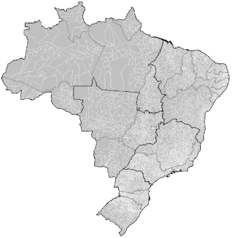

# city-codes

&nbsp;  &nbsp; [ datapackage preview](http://data.okfn.org/tools/view?url=https%3A%2F%2Fraw.githubusercontent.com%2Fdatasets-br%2Fcity-codes%2Fmaster%2Fdatapackage.json)

Comprehensive Brazilian city code information, including IBGE codes, wikidata IDs and URN LEX labels. 
Provided as a Simple Data Format Data Package (see datapackage.json visualization).

Brazilian city names and official codes of 5570 municipalities.

## See also 

* http://datasets.OK.org.br/state-codes
* http://frictionLessData.io
* https://pt.wikipedia.org/wiki/Lista_de_munic%C3%ADpios_do_Brasil
